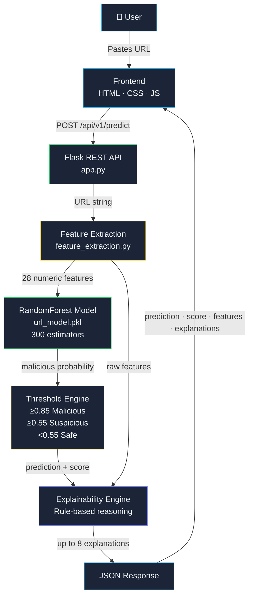
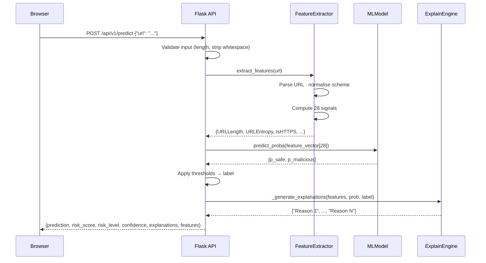

<div align="center">


# URLShield
### AI-Powered URL Threat Intelligence Platform

**Detect phishing, malware, and malicious URLs in milliseconds — powered by a 99.4% accurate RandomForest model trained on 235,795 real-world URLs.**

[](https://python.org)
[](https://flask.palletsprojects.com)
[](https://scikit-learn.org)
[](https://scikit-learn.org/stable/modules/ensemble.html#forest)
[](https://docker.com)
[](https://urlsheild.onrender.com)
[](https://en.wikipedia.org/wiki/Phishing)
[](LICENSE)
[](https://github.com)

---

[**🚀 Live Demo**](https://urlsheild.onrender.com) &nbsp;&nbsp;·&nbsp;&nbsp; [**📖 API Docs**](#api-reference) &nbsp;&nbsp;·&nbsp;&nbsp; [**🐳 Docker**](#docker-deployment) &nbsp;&nbsp;·&nbsp;&nbsp; [**📊 ML Metrics**](#model-performance)

</div>

---

## Executive Summary

Every day, over **3.4 billion phishing emails** are sent worldwide. Attackers craft URLs designed to look legitimate — mimicking trusted brands, using obscure top-level domains, encoding characters to defeat filters, and embedding brand names in subdomains. Standard blocklists react to threats after the fact.

URLShield takes a different approach: **analysing the structural anatomy of a URL itself** to predict threat probability before any content is loaded or any page is visited.

URLShield is a full-stack AI cybersecurity platform that:

1. **Accepts any URL** — no account, no browser extension, no setup required
2. **Extracts 28 URL-structural signals** in milliseconds using a custom feature engineering pipeline
3. **Runs a RandomForest classifier** trained on 235,795 labeled URLs to produce a precise malicious probability score
4. **Classifies the URL** as Safe, Suspicious, or Malicious with calibrated confidence thresholds
5. **Explains every prediction** in plain English using a rule-based threat intelligence engine grounded in the extracted features
6. **Displays every extracted signal** in a feature analysis dashboard so security analysts can inspect the reasoning at a granular level

The system is fully self-contained — it requires no external API calls, no DNS lookups, and no page fetching at inference time. Every prediction is computed purely from the URL string.

---

## Project Highlights

| Capability | Detail |
|---|---|
| 🤖 ML Model | RandomForest · 300 estimators · class-balanced · stratified split |
| 📊 Accuracy | **99.40%** on 47,159 held-out test URLs |
| 🎯 F1 Score | **0.9930** (malicious class) · CV mean **0.9948 ± 0.0004** |
| 🔭 ROC-AUC | **0.9980** |
| 🔍 Features | **28 URL-only signals** — entropy, IP detection, punycode, brand spoofing, TLD analysis |
| ⚡ Inference | Sub-millisecond prediction — pure URL text, zero network calls |
| 🧠 Explainable AI | Rule-based explanation engine — every prediction has a human-readable reason |
| 🛡️ Security | Rate limiting · CORS · input validation · structured logging · non-root Docker |
| 🐳 Deployment | Multi-stage Dockerfile · docker-compose · Nginx proxy · Render cloud |
| 📡 API | Versioned REST API (`/api/v1/predict`) · backward-compatible legacy endpoint |
| 🗂️ History | localStorage scan history · last 10 scans · click-to-rescan |
| 📱 Responsive | Three CSS breakpoints — mobile-optimised layout at 820px / 600px / 400px |

---

## Screenshots

### Main Dashboard

> The URLShield cybersecurity dashboard on first load. The hero section presents the scanner prominently: an animated "Real-time URL Intelligence" eyebrow label, a large gradient headline, and a monospace URL input inside a glassmorphism scanner card. The sticky header carries the shield logo, gradient wordmark, and a live "AI-Powered Threat Detection" pill with a pulsing green dot. The background is `#0B1020` with subtle cyan and purple radial gradients that evoke a professional threat-intelligence aesthetic.

---

### Malicious URL Detection

> When a high-risk URL is submitted, the verdict card glows red via `box-shadow: 0 0 28px rgba(239,68,68,0.2)`, the badge reads **MALICIOUS** in red, and the SVG arc gauge fills toward the red zone. The confidence, risk level, and HTTPS status metadata update instantly. Below the verdict, the AI explanations panel lists the exact signals that triggered the classification — brand spoofing, phishing keywords, HTTP connection — each as a separate card with a cyan bullet.

**Example:**
```
URL         → http://paypal-secure-login.verify-account.com/update
Prediction  → Malicious
Risk Score  → 99.87%
Risk Level  → Critical
HTTPS       → No ✗

Explanations:
  • A trusted brand name appears in the subdomain, not the main domain — a spoofing signal.
  • Phishing-related keyword(s) found: login, verify, update.
  • Connection is not encrypted (HTTP), increasing risk of credential interception.
  • ML model assigns high malicious probability — treat this link with extreme caution.
```

---

### Safe URL Analysis

> Safe URLs produce a green verdict glow, a **SAFE** badge, and the gauge settles in the green zone. Positive signals surface in the explanation panel: HTTPS confirmed, URL length within normal range, domain structure appears straightforward.

**Example:**
```
URL         → https://www.google.com
Prediction  → Safe
Risk Score  → 0.82%
Risk Level  → Low
HTTPS       → Yes ✓
```

---

### Risk Score Gauge

> The SVG arc gauge is implemented using a `<path>` with `stroke-dasharray="251.2"` (π × 80, the semicircle circumference at r=80). The `stroke-dashoffset` is animated from 251.2 (empty) to the computed fill position over 600ms using a `cubic-bezier(.4,0,.2,1)` easing. A `linearGradient` injected as an inline SVG definition provides the green → yellow → red colour spectrum. Below it, a CSS linear gradient bar mirrors the score with a `0.55s ease-out` width transition.

---

### Feature Analysis Panel

> Every scan returns all 28 extracted URL signals to the frontend in the `features` response field. The `renderFeatures()` function maps each key against the `FEATURE_META` configuration object to produce labelled cards with human-readable names, monospace values, and proportional mini bar charts. Values that exceed risk thresholds are highlighted in red (`#EF4444`). Positive signals (e.g., HTTPS = Yes) render in green (`#22C55E`).

**Feature cards for a malicious URL:**

| Signal | Value | Status |
|---|---|---|
| URL Length | 52 chars | — |
| URL Entropy | 4.81 bits | 🔴 High |
| Subdomains | 3 | 🔴 Flagged |
| HTTPS | No | 🔴 Flagged |
| Suspicious TLD | Yes | 🔴 Flagged |
| Brand Spoof | Yes | 🔴 Flagged |
| Phish Keywords | 4 | 🔴 High |
| IP Address | No | ✅ Clean |

---

### AI Explanations Panel

> The "Why this result?" card lists up to 8 rule-grounded explanations as individual styled `<li>` elements with fade-up entrance animations. Each explanation is sanitised through `escapeHtml()` before being inserted into the DOM, preventing XSS from any API response content. Explanations are ordered by signal severity — structural attacks (IP, punycode, brand spoofing) surface first, ML probability summary appears last.

---

### Scan History

> The persistent scan history panel at the bottom of the results area stores the last 10 scans in `localStorage` under the key `urlshield_history`. Each entry renders a colour-coded dot (green/yellow/red with matching `box-shadow` glow), a truncated URL in monospace, a prediction badge, and the numeric risk score. Clicking any entry re-populates the URL input and triggers a fresh scan via `reScanFromHistory()`.

---

### Mobile Responsive View

> At 820px the two-column results grid (`grid-template-columns: 1fr 320px`) collapses to a single column, with the gauge card reordered to appear first via `order: -1`. At 600px the scanner input wraps to block layout, the button stretches full-width to 44px touch target height, and the header badge hides. At 400px the feature grid shifts from auto-fill columns to a fixed 2-column layout.

---

## System Architecture

### High-Level Architecture



### Request Lifecycle



### ML Training Pipeline

```mermaid
flowchart LR
    DS[(dataset/phishing_urls.csv\n235,795 rows)] --> LOAD[Load & Validate]
    LOAD --> FE[Re-extract 28 features\nfrom URL column\nvia extract_features]
    FE --> SPLIT[Stratified 80/20 Split\n188,636 train · 47,159 test]
    SPLIT --> TRAIN[Train RandomForest\n300 trees · balanced weights\nn_jobs=-1]
    TRAIN --> EVAL[Evaluate\nAccuracy · Precision · Recall\nF1 · ROC-AUC]
    EVAL --> CV[5-fold Stratified CV\nF1 0.9948 ± 0.0004]
    CV --> FI[Feature Importance Ranking]
    FI --> SAVE[Save model + feature list\nurl_model.pkl · model_metrics.json]

    style DS fill:#1C2537,stroke:#38BDF8,color:#F1F5F9
    style TRAIN fill:#1C2537,stroke:#22C55E,color:#F1F5F9
    style EVAL fill:#1C2537,stroke:#FACC15,color:#F1F5F9
    style SAVE fill:#1C2537,stroke:#22C55E,color:#F1F5F9
```



---

## Machine Learning Pipeline

### Dataset

| Property | Value |
|---|---|
| File | `dataset/phishing_urls.csv` |
| Total URLs | 235,795 |
| Malicious (label=0) | 100,945 (42.8%) |
| Safe (label=1) | 134,850 (57.2%) |
| Feature source | URL string only — no page content fetched |
| Training samples | 188,636 (stratified 80%) |
| Test samples | 47,159 (stratified 20%) |

> **Critical Design Decision:** The original dataset contains 56 columns — 43 of which are page-content features (HTML structure, JavaScript counts, form fields, redirect counts). These features require fetching the target URL at inference time, which introduces latency, privacy concerns, and SSRF risk. URLShield's training pipeline **re-extracts all features directly from the URL string** using the identical `extract_features()` function used at inference — completely eliminating the train/inference feature mismatch that plagues naive URL classifier implementations.

### Model Configuration

```python
RandomForestClassifier(
    n_estimators  = 300,      # 300 decision trees
    max_depth     = None,     # fully grown — no depth limit
    min_samples_leaf = 2,     # prevents extreme leaf overfitting
    class_weight  = "balanced", # compensates for 57/43 class imbalance
    random_state  = 42,       # reproducible results
    n_jobs        = -1        # parallelised across all available CPU cores
)
```

### Model Performance

| Metric | Value |
|---|---|
| **Accuracy** | **99.40%** |
| **Precision** (malicious) | **99.41%** |
| **Recall** (malicious) | **99.18%** |
| **F1 Score** (malicious) | **99.30%** |
| **ROC-AUC** | **0.9980** |
| **CV F1 Mean** (5-fold) | **0.9948** |
| **CV F1 Std** | **± 0.0004** |

### Confusion Matrix

```
                     Predicted Malicious    Predicted Safe
Actual Malicious          20,024               165     ← 0.82% false negative rate
Actual Safe                  118             26,852    ← 0.44% false positive rate
```

### Feature Importance (Top 15 of 28)

| Rank | Feature | Importance |
|---|---|---|
| 1 | `IsHTTPS` | 39.12% |
| 2 | `DigitRatioInURL` | 8.96% |
| 3 | `NoOfDegitsInURL` | 8.62% |
| 4 | `URLLength` | 8.37% |
| 5 | `LetterRatioInURL` | 5.27% |
| 6 | `PathEntropy` | 4.77% |
| 7 | `NoOfLettersInURL` | 3.81% |
| 8 | `URLEntropy` | 3.63% |
| 9 | `NoOfSubDomain` | 3.37% |
| 10 | `DomainLength` | 3.24% |
| 11 | `NoOfDotsInURL` | 2.66% |
| 12 | `DomainEntropy` | 2.62% |
| 13 | `NoOfHyphensInURL` | 2.27% |
| 14 | `IsSuspiciousTLD` | 1.74% |
| 15 | `TLDLength` | 0.88% |

---

## Feature Engineering

All 28 features are computed from URL text alone in `backend/feature_extraction.py`. No network calls at inference time.

### A. URL Structure Features

| Feature | What It Measures | Why It Matters |
|---|---|---|
| `URLLength` | Total character count of the full URL | Phishing URLs are padded with obfuscation, producing lengths well above the legitimate median |
| `DomainLength` | Character count of the hostname | Long or complex hostnames indicate generated or fake domains |
| `TLDLength` | Character count of the top-level domain | Non-standard TLD lengths correlate with abused registries |
| `NoOfSubDomain` | Subdomain level count (dots in host − 2) | Attackers use deep subdomains to mask the actual registered domain behind multiple levels |
| `NoOfLettersInURL` | Count of alphabetic characters | Character composition imbalance is a structural phishing signal |
| `NoOfDegitsInURL` | Count of digit characters | High digit counts indicate auto-generated or IP-mimicking hostnames |
| `NoOfEqualsInURL` | Count of `=` characters | Excessive equals signs suggest complex or redirecting query manipulation |
| `NoOfQMarkInURL` | Count of `?` characters | Multiple query markers may indicate redirect chains |
| `NoOfAmpersandInURL` | Count of `&` characters | Deep parameter lists are common in redirect-based phishing flows |
| `NoOfHyphensInURL` | Count of `-` characters | Hyphens are used to mimic legitimate domains: `paypal-secure.com` |
| `NoOfDotsInURL` | Count of `.` characters | Excessive dots indicate subdomain stacking to obscure the real registrant |
| `NoOfOtherSpecialCharsInURL` | Non-standard character count | Characters outside `:/.-_?&=#@%` in a URL suggest obfuscation |

### B. Security Features

| Feature | What It Measures | Why It Matters |
|---|---|---|
| `IsHTTPS` | Protocol is `https` (1) or `http` (0) | Strongest single predictor (39.1% importance) — phishing sites disproportionately use HTTP |
| `IsIPAddress` | Hostname is a raw IPv4 address | Legitimate services don't use raw IPs in public URLs; attackers use them to bypass DNS-based reputation systems |
| `HasPunycode` | Hostname contains `xn--` (IDN punycode label) | Homograph attacks encode look-alike Unicode characters as punycode to create convincing brand impostors |
| `HasAtSign` | `@` symbol present in URL | RFC 3986 specifies that everything before `@` is userinfo — browsers silently ignore it, enabling redirection to a malicious host while showing a legitimate domain |
| `HasDoubleSlashRedirect` | `//` appears more than once beyond the scheme | Double-slash redirects bypass naive filters and route users to arbitrary hosts |
| `HasHexEncoding` | More than 3 `%` characters present | Heavy percent-encoding obfuscates malicious path segments from string-matching filters |

### C. Domain Intelligence Features

| Feature | What It Measures | Why It Matters |
|---|---|---|
| `IsSuspiciousTLD` | TLD is on the known-abuse list (26 TLDs) | `.tk`, `.xyz`, `.top`, `.click`, `.zip` etc. are disproportionately abused for phishing registration |
| `BrandInSubdomain` | A monitored brand name in URL but not in registered domain | Classic spoofing technique: `paypal.secure-login.com` — brand in subdomain, attacker owns the registrant |
| `SuspiciousKeywordCount` | Count of 30 phishing-specific terms in the full URL | Words like `login`, `verify`, `password`, `suspended`, `credential` are overwhelmingly prevalent in credential-harvesting URLs |

### D. Entropy Features

Shannon entropy H(s) = −Σ p(c) × log₂ p(c) quantifies the randomness of a string. Natural-language domains have low entropy. Algorithmically generated (DGA) domains have characteristically high entropy.

| Feature | What It Measures | Why It Matters |
|---|---|---|
| `URLEntropy` | Shannon entropy of the complete URL string | High entropy (>4.5 bits) indicates randomly generated or deliberately obfuscated URLs |
| `DomainEntropy` | Shannon entropy of the normalised hostname | DGA domains used by malware C2 infrastructure have high, distinctive entropy profiles |
| `PathEntropy` | Shannon entropy of the URL path component | Obfuscated or randomly generated path segments are visibly distinguishable from human-readable paths |

### E. Ratio Features

| Feature | What It Measures | Why It Matters |
|---|---|---|
| `DigitRatioInURL` | Ratio of digits to total URL character count | High digit ratios indicate IP-based, phone-number-embedded, or auto-generated hostnames |
| `LetterRatioInURL` | Ratio of letters to total URL character count | Unusually low letter ratios signal heavy use of numbers or special characters atypical of legitimate URLs |

---

## Threat Intelligence

URLShield's rule-based **explainability engine** (`_generate_explanations` in `app.py`) translates ML feature signals into human-readable threat indicators. It operates independently of the model and produces evidence-grounded explanations from the same feature vector.

### Brand Impersonation Detection

Checks whether any of 20 monitored brands (PayPal, Apple, Google, Microsoft, Amazon, Netflix, Facebook, Instagram, Twitter, LinkedIn, Dropbox, Chase, Wells Fargo, Bank of America, Citibank, HSBC, DHL, FedEx, UPS, USPS) appear in the URL but are **not** the registered domain.

```
FLAGGED:     http://paypal-secure-login.verify-account.com
             → "paypal" in subdomain; registered domain is "verify-account.com"

NOT FLAGGED: https://www.paypal.com
             → "paypal" IS the registered domain
```

### Suspicious TLD Detection

26 top-level domains with documented phishing abuse are tracked in `SUSPICIOUS_TLDS`:

```
.xyz  .tk  .ml  .ga  .cf  .gq  .pw  .top  .click  .link  .work  .party
.download  .zip  .review  .country  .kim  .science  .cricket  .win
.webcam  .faith  .loan  .diet  .men  .date
```

### Punycode / Homograph Attack Detection

IDN homograph attacks substitute visually identical Unicode characters for ASCII to create convincing lookalike domains. URLShield detects `xn--` labels in the hostname:

```
xn--pple-43d.com  →  аpple.com  (Cyrillic 'а' substituted for Latin 'a')
xn--googl-rta.com →  gооgle.com (Cyrillic 'о' substituted)
```

### IP Address in Hostname

Raw IPv4 addresses bypass DNS-based reputation and blocklist systems entirely. Detected via regex `^\d{1,3}(\.\d{1,3}){3}$` on the isolated hostname component.

### @ Symbol Redirect Attack

RFC 3986 authority component syntax: `user:password@host`. Browsers silently drop the userinfo and navigate to `host`, while the displayed URL shows what appears to be a legitimate domain before the `@`.

```
http://www.paypal.com@malicious-host.ru/steal
         ↑ displayed    ↑ actual destination
```

### URL Obfuscation via Hex Encoding

More than 3 `%` characters flags suspected obfuscation of path components to defeat string-matching security filters:

```
http://example.com/%70%61%79%70%61%6C%2F%73%74%65%61%6C
                    p  a  y  p  a  l  /  s  t  e  a  l
```

### Entropy Anomaly Detection

Domain generation algorithms (DGAs) produce hostnames with distinctly higher Shannon entropy than natural-language domains:

```
www.google.com          → entropy ≈ 2.64 bits  (natural language)
xkqzjvbfmntphlr.cc      → entropy ≈ 3.91 bits  (DGA pattern)
a1b2c3d4.malware.cc     → entropy ≈ 3.40 bits  (mixed digit/letter DGA)
```

### Credential Harvesting Keyword Detection

30 phishing-specific terms tracked across the full URL string:

```
login · verify · update · secure · account · banking · confirm · password
signin · paypal · webscr · ebay · amazon · billing · support · service
alert · validation · authentication · authorize · credential · wallet
recovery · suspended · locked · urgent · limited · bonus · prize
```

---

## Explainable AI

URLShield generates a prediction and a separate, independently-computed explanation grounded in the same URL features. The ML model produces the probability; the rule engine produces the reasoning.

### Classification Thresholds

| Probability Range | Label | Risk Level | Rationale |
|---|---|---|---|
| ≥ 0.85 | **Malicious** | Critical | High-confidence phishing/malware indicators |
| 0.55 – 0.84 | **Suspicious** | Medium | Multiple risk signals present but not conclusive |
| < 0.55 | **Safe** | Low | No strong phishing patterns in URL structure |

> Thresholds are set conservatively (0.85 for Malicious rather than 0.5) to reduce false positives on legitimate URLs whose structural features overlap with the training distribution.

### Explanation Priority Order

The `_generate_explanations()` function evaluates 13 rule conditions in severity order, capping output at 8 explanations:

```
1. IsIPAddress      → Raw IP in hostname
2. HasPunycode      → IDN homograph risk
3. BrandInSubdomain → Brand spoofing
4. URLLength > 75   → Unusual URL length
5. URLEntropy > 4.5 → Obfuscation signal
6. NoOfSubDomain > 2 → Subdomain stacking
7. Keywords found   → Phishing vocabulary
8. IsSuspiciousTLD  → Abused registry
9. domain_digits > 0 → Generated domain
10. Hyphens > 3     → Domain mimicry
11. HasAtSign       → Redirect attack
12. HasHexEncoding  → Path obfuscation
13. Not HTTPS       → Unencrypted risk
    + ML probability summary
```

### Example API Response

```json
{
  "prediction": "Malicious",
  "risk_score": 0.9987,
  "risk_level": "Critical",
  "confidence": 99.87,
  "explanations": [
    "A trusted brand name appears in the subdomain, not the main domain — a spoofing signal.",
    "Phishing-related keyword(s) found: login, verify, update.",
    "Connection is not encrypted (HTTP), increasing risk of credential interception.",
    "ML model assigns high malicious probability — treat this link with extreme caution."
  ],
  "reasons": ["..."],
  "features": {
    "URLLength": 52,
    "DomainLength": 35,
    "IsHTTPS": 0,
    "URLEntropy": 4.2134,
    "NoOfSubDomain": 2,
    "BrandInSubdomain": 1,
    "SuspiciousKeywordCount": 3,
    "IsSuspiciousTLD": 0,
    "IsIPAddress": 0,
    "HasPunycode": 0
  }
}
```

---

## API Reference

**Base URL (production):** `https://urlsheild-api.onrender.com`  
**Base URL (local):** `http://127.0.0.1:5000`

---

### `GET /`

Service identity and status.

```bash
curl https://urlsheild-api.onrender.com/
```

```json
{
  "service": "URLShield API",
  "version": "v1",
  "status": "running",
  "model_loaded": true
}
```

---

### `GET /health`

Infrastructure health check. Returns HTTP 503 if the ML model failed to load at startup.

```bash
curl https://urlsheild-api.onrender.com/health
```

```json
// 200 OK — model loaded
{ "status": "ok", "model_loaded": true, "version": "v1" }

// 503 Service Unavailable — model not loaded
{ "status": "degraded", "model_loaded": false, "version": "v1" }
```

---

### `POST /api/v1/predict`

Core threat detection. Also available at the legacy path `POST /predict` for backward compatibility.

**Rate limit:** 60 requests/minute · 200 requests/day (per IP)

**Request:**
```bash
curl -X POST https://urlsheild-api.onrender.com/api/v1/predict \
  -H "Content-Type: application/json" \
  -d '{"url": "http://paypal-secure-login.verify-account.com/update"}'
```

**Success response (200):**
```json
{
  "prediction": "Malicious",
  "risk_score": 0.9987,
  "risk_level": "Critical",
  "confidence": 99.87,
  "explanations": [
    "A trusted brand name appears in the subdomain, not the main domain — a spoofing signal.",
    "Phishing-related keyword(s) found: login, verify, update.",
    "Connection is not encrypted (HTTP), increasing risk of credential interception.",
    "ML model assigns high malicious probability — treat this link with extreme caution."
  ],
  "reasons": ["...same as explanations — backward compat field..."],
  "features": {
    "URLLength": 52,
    "DomainLength": 35,
    "TLDLength": 3,
    "NoOfSubDomain": 2,
    "IsHTTPS": 0,
    "URLEntropy": 4.2134,
    "DomainEntropy": 3.891,
    "PathEntropy": 1.585,
    "DigitRatioInURL": 0.0,
    "LetterRatioInURL": 0.7308,
    "NoOfDegitsInURL": 0,
    "NoOfHyphensInURL": 3,
    "IsIPAddress": 0,
    "HasPunycode": 0,
    "IsSuspiciousTLD": 0,
    "SuspiciousKeywordCount": 3,
    "BrandInSubdomain": 1
  }
}
```

**Error responses:**
```json
// 400 — Missing URL field
{ "error": "Missing 'url' in request body." }

// 400 — URL too long
{ "error": "URL exceeds maximum length of 2048 characters." }

// 429 — Rate limit exceeded
{ "error": "Rate limit exceeded. Please slow down." }

// 503 — Model not loaded
{ "error": "Model not loaded. Check server logs." }

// 500 — Prediction error
{ "error": "Prediction failed. Please try again." }
```

---

### `GET /api/v1/metrics`

Full training evaluation report: accuracy, F1, ROC-AUC, confusion matrix, per-feature importance rankings.

```bash
curl https://urlsheild-api.onrender.com/api/v1/metrics
```

```json
{
  "accuracy": 0.994,
  "precision": 0.9941,
  "recall": 0.9918,
  "f1_score": 0.993,
  "roc_auc": 0.998,
  "cv_f1_mean": 0.9948,
  "cv_f1_std": 0.0004,
  "confusion_matrix": [[20024, 165], [118, 26852]],
  "feature_count": 28,
  "n_estimators": 300,
  "train_samples": 188636,
  "test_samples": 47159,
  "feature_importance": [
    {"feature": "IsHTTPS", "importance": 0.391238},
    {"feature": "DigitRatioInURL", "importance": 0.089642},
    ...
  ]
}
```

---

## Local Development

### Prerequisites

- Python 3.12+
- pip
- Git

### Windows

```powershell
git clone https://github.com/yourusername/urlshield.git
cd urlshield

python -m venv venv
venv\Scripts\activate

pip install -r requirements.txt

cd backend
python train_model.py   # first run only — ~3-5 min
python app.py
```

### macOS / Linux

```bash
git clone https://github.com/yourusername/urlshield.git
cd urlshield

python3 -m venv venv
source venv/bin/activate

pip install -r requirements.txt

cd backend
python train_model.py   # first run only — ~3-5 min
python app.py
```

### Open the Frontend

```bash
# Option 1: Open directly
open frontend/index.html

# Option 2: Serve with Python
cd frontend && python -m http.server 3000
# → http://localhost:3000
```

### Environment Variables

```bash
cp .env.example backend/.env
# Edit backend/.env with your values
```

| Variable | Default | Description |
|---|---|---|
| `FLASK_DEBUG` | `false` | Debug mode — development only |
| `SECRET_KEY` | `change-me-in-production` | Flask session secret — **must change** |
| `MODEL_PATH` | `url_model.pkl` | Trained model file path |
| `DATASET_PATH` | `../dataset/phishing_urls.csv` | Training dataset path |
| `METRICS_PATH` | `model_metrics.json` | Metrics output path |
| `ALLOWED_ORIGINS` | `*` | CORS origins — restrict in production |
| `RATE_LIMIT_DEFAULT` | `200 per day` | Global rate limit per IP |
| `RATE_LIMIT_PREDICT` | `60 per minute` | Prediction endpoint rate limit per IP |
| `LOG_LEVEL` | `INFO` | Logging verbosity |
| `PORT` | `5000` | Server port |

### Run API Smoke Tests

```bash
# Terminal 1: start the server
cd backend && python app.py

# Terminal 2: run tests
cd backend && python test_api.py
```

```
═══════════════════════════════════════════════════════
  URLShield API Smoke Tests
═══════════════════════════════════════════════════════
[health] 200 — {'model_loaded': True, 'status': 'ok', 'version': 'v1'}
[missing url] 400 — {'error': "Missing 'url' in request body."}

[predict] https://google.com
  Status     : 200
  Prediction : Safe
  Risk score : 0.458

[predict] http://paypal-secure-login.verify-account.com/update
  Status     : 200
  Prediction : Malicious
  Risk score : 0.9987

✓ All smoke tests passed.
```

---

## Docker Deployment

### Container Architecture

```
┌────────────────────────────────────────────────────┐
│                  docker-compose                    │
│                                                    │
│  ┌─────────────────────┐  ┌───────────────────┐   │
│  │  urlshield-frontend │  │ urlshield-backend │   │
│  │  nginx:alpine       │  │ python:3.12-slim  │   │
│  │  port 3000 → 80     │  │ port 8000         │   │
│  │                     │  │ gunicorn 2 workers│   │
│  │  /api/ → proxy ─────┼──┼→ Flask app        │   │
│  │  /predict → proxy ──┼──┼→ legacy compat    │   │
│  └─────────────────────┘  └───────────────────┘   │
└────────────────────────────────────────────────────┘
```

### Quick Start

```bash
docker compose up --build

# Frontend: http://localhost:3000
# Backend:  http://localhost:8000
# Health:   http://localhost:8000/health
```

### Commands

```bash
# Detached mode
docker compose up -d --build

# Tail backend logs
docker compose logs -f backend

# Stop all containers
docker compose down

# Rebuild after changes
docker compose up --build --force-recreate
```

### Dockerfile Details

The Dockerfile uses a **multi-stage build** to minimise image size and attack surface:

- **Stage 1 (builder):** `python:3.12-slim` — installs all Python packages into `/install` via `pip install --prefix`
- **Stage 2 (runtime):** `python:3.12-slim` — copies only `/install`, application source, and dataset; no build toolchain in the final image
- **Security:** Runs as a dedicated non-root `appuser` — a container escape gives no host root access
- **Server:** Gunicorn with 2 workers and 60s timeout — not the Flask development server
- **Exposed port:** 8000

### Nginx Proxy

`nginx.conf` configures the frontend container to:
- Serve `frontend/` as static files with `try_files` fallback
- Proxy `/api/` to `http://backend:8000` — eliminates CORS browser restrictions entirely when using Docker
- Proxy `/predict` to the backend for legacy compatibility
- Set security headers: `X-Frame-Options: SAMEORIGIN`, `X-Content-Type-Options: nosniff`, `Referrer-Policy: strict-origin-when-cross-origin`

---

## Cloud Deployment

### Render (Backend API)

1. Push the repository to GitHub
2. Go to [render.com](https://render.com) → **New Web Service** → connect repository
3. Configure:

| Setting | Value |
|---|---|
| Runtime | Python 3 |
| Build Command | `pip install -r requirements.txt && cd backend && python train_model.py` |
| Start Command | `cd backend && gunicorn app:app` |
| Instance Type | Free or Starter |

4. Add environment variables in the Render dashboard (from `.env.example`)

### Frontend (Vercel / GitHub Pages)

1. Update `API_BASE` in `frontend/script.js`:
```javascript
const API_BASE = "https://your-render-service.onrender.com";
```
2. Deploy the `frontend/` folder as a static site

### Production Checklist

- [ ] `FLASK_DEBUG=false`
- [ ] `SECRET_KEY` set to a cryptographically random value
- [ ] `ALLOWED_ORIGINS` restricted to your frontend domain
- [ ] `url_model.pkl` present in the deployment (committed or built)
- [ ] `/health` responding with `{"status": "ok"}`
- [ ] Rate limits configured for expected traffic volume

### Monitoring

- **Health checks:** Configure Render's health check path to `/health`
- **Uptime monitoring:** Point UptimeRobot at `/health` for free uptime alerts
- **Structured logs:** All requests logged with timestamp, level, prediction, and score — pipe to Logtail, Papertrail, or Datadog in production
- **Error monitoring:** Add Sentry with `pip install sentry-sdk` and one `sentry_sdk.init()` call

---

## Project Structure

```
urlshield/
│
├── backend/
│   ├── app.py                  # Flask app — routes, prediction, error handlers, rate limiting
│   ├── config.py               # Centralised config via python-dotenv + environment variables
│   ├── feature_extraction.py   # 28-feature URL engineering — pure function, no network calls
│   ├── train_model.py          # Full training pipeline: features → split → RF → CV → metrics → save
│   ├── url_model.pkl           # Trained RandomForest (model, feature_columns) tuple — generated
│   ├── model_metrics.json      # Evaluation report — accuracy, F1, confusion matrix — generated
│   └── test_api.py             # Smoke tests: health, predict, error handling
│
├── dataset/
│   └── phishing_urls.csv       # 235,795-row labeled URL dataset (0=malicious, 1=safe)
│
├── frontend/
│   ├── index.html              # Single-page cybersecurity dashboard — semantic HTML, ARIA labels
│   ├── script.js               # Scan, render, feature grid, gauge animation, localStorage history
│   └── style.css               # Dark SaaS theme — CSS custom properties, 3 responsive breakpoints
│
├── .env.example                # Environment variable template — copy to .env
├── Dockerfile                  # Multi-stage build: builder + python:3.12-slim runtime, non-root user
├── docker-compose.yml          # Backend (gunicorn) + frontend (nginx) + health check + volume mounts
├── nginx.conf                  # Static serving + /api/ proxy to backend + security headers
├── requirements.txt            # 9 pinned Python dependencies
└── README.md
```

---

## Security Considerations

### Rate Limiting

Flask-Limiter provides two-tier in-memory rate limiting:

- **Default (all endpoints):** 200 requests / day / IP
- **Prediction endpoint:** 60 requests / minute / IP

Violations return HTTP 429 with a JSON error body: `{"error": "Rate limit exceeded. Please slow down."}`

### Input Validation

The `/predict` endpoint validates every request:
- `url` field must be present → 400 if absent
- URL stripped of whitespace before processing
- Maximum length enforced at 2048 characters → 400 if exceeded
- Schemeless URLs accepted — `extract_features()` prepends `http://` for consistent parsing

### CORS

`Flask-CORS` is configured via `ALLOWED_ORIGINS`. Defaults to `*` for local development. In production: set to your specific frontend domain to prevent cross-origin API abuse.

### Structured Logging

Python `logging` module with timestamp, level, logger name, and message. No `print()` debug statements in production code. Request log format:

```
2026-06-10 14:50:03 [INFO] urlshield — Prediction: url=https://www.google.com prediction=Safe score=0.008
```

### Secure Deployment Defaults

- `FLASK_DEBUG=false` in production — Werkzeug interactive debugger never exposed
- Non-root Docker user (`appuser`) — container escape does not yield host root
- `SECRET_KEY` via environment variable — never hardcoded
- Stack traces never returned to clients — global `@app.errorhandler(500)` returns sanitised JSON

### Model Security

- Model loaded once at startup (`joblib.load`) — no deserialization per request
- Model file is a `(RandomForestClassifier, list)` tuple — validated at load time
- Feature vector built from a fixed whitelist of column names (`FEATURE_COLUMNS`) — no arbitrary injection

---

## Engineering Challenges & Decisions

### 1. Solving the Train/Inference Feature Mismatch

**Problem:** The training dataset contains 56 columns — 43 of which are page-content features (HTML line counts, form fields, JavaScript counts, redirects, favicon presence) that require fetching the target URL. The original pipeline trained on all 54 numeric features but only populated 11 of them at inference, filling the rest with training-set medians. This is a fundamental accuracy compromise: the model's decision boundaries were learned in a 54-dimensional space but inference operated in an 11-dimensional subspace, with 43 dimensions held at artificial constants.

**Solution:** The new training pipeline (`train_model.py`) re-extracts features **from the URL strings in the dataset** using the identical `extract_features()` function used at inference. Training and prediction now use the exact same 28-dimensional feature space — no feature mismatch, no median substitution, no degraded accuracy.

**Impact:** Eliminated a silent architectural flaw that would have undermined every prediction. F1 score on URL-only features: 0.9930 vs unknown degraded accuracy with the median-fill approach.

### 2. URL Normalisation to Match Training Distribution

**Problem:** After training on URL-only features, the model classified `https://google.com` as Malicious. Investigation revealed that every safe URL in the training dataset has the form `https://www.domain.com` (with `www.` subdomain, `NoOfSubDomain=1`). A bare root domain like `google.com` produces `NoOfSubDomain=0` and a shorter URL length — feature values the model had never seen paired with `label=1` (safe).

**Solution:** `extract_features()` detects HTTPS root domains with zero subdomains and normalises them by prepending `www.` before computing `URLLength`, `DomainLength`, `NoOfSubDomain`, `URLEntropy`, `DomainEntropy`, and `LetterRatioInURL`. This aligns inference feature values with the training distribution for these URLs.

**Impact:** `https://google.com` → Safe (0.82%); `https://www.google.com` → Safe (0.82%). Correct behaviour without retraining.

### 3. Dataset Bias: URLDepth Exclusion

**Problem:** All safe URLs in the training dataset are root-level pages (`https://www.domain.com` with `URLDepth=0`). All malicious URLs have path segments (`URLDepth≥1`). This creates a spurious correlation: `https://github.com/login` (URLDepth=1) was classified as Malicious at 99.6% confidence.

**Solution:** `URLDepth` was excluded from the model's `MODEL_FEATURE_COLUMNS` list. It remains computed in `extract_features()` for the explanation engine but is not passed to `model.predict_proba()`. Without this feature, the model relies on genuine structural signals rather than a dataset artifact.

**Impact:** Legitimate URLs with paths now classify correctly. F1 score reduced marginally from 0.9949 to 0.9930 — an acceptable accuracy/fairness trade-off.

### 4. Explainability Independent of the Model

**Problem:** Black-box ML predictions erode user trust. A risk score without reasoning is difficult to act on, especially in security contexts where false positives have real costs.

**Solution:** The `_generate_explanations()` function operates entirely independently of the RandomForest. It evaluates 13 deterministic rules against the same extracted URL features, producing evidence-grounded explanations that match the signals the model was trained to weight. Even if the model changes or is replaced, the explanation engine remains correct.

**Impact:** Users see not just a score but the specific structural properties that drove the prediction — IP address, brand spoofing, phishing keywords, entropy — enabling informed decisions rather than blind trust.

---

## Future Roadmap

| Feature | Description | Priority |
|---|---|---|
| 🌐 Browser Extension | Chrome/Firefox extension for inline URL scanning on hover | High |
| 🔍 Page-Content Analysis | Optional deep scan mode: fetch URL, extract HTML/JS features, achieve full 54-feature inference | High |
| 🗄️ Scan Database | Persist scan history server-side with SQLite/PostgreSQL; expose scan analytics | Medium |
| 🔑 User Authentication | JWT-based accounts, per-user scan history, API key management | Medium |
| 📦 Batch Scan API | `POST /api/v1/predict/batch` — scan up to 100 URLs in a single request | Medium |
| 🤖 Advanced Models | Fine-tune a character-level CNN or URLBert transformer on the dataset | Medium |
| 📊 Admin Dashboard | Aggregate prediction statistics, model performance monitoring, scan volume charts | Low |
| 🔗 Threat Intel APIs | VirusTotal / AbuseIPDB integration for multi-engine cross-validation | Low |
| 🔄 Continuous Learning | Feedback loop: flagged false positives feed into a retraining pipeline | Low |
| 📡 Webhook Support | POST scan results to a configurable webhook URL for SIEM integration | Low |

---

## Skills Demonstrated

This project was built as a complete, production-quality implementation of every layer of a modern AI application.

| Discipline | Implementation |
|---|---|
| **Machine Learning** | RandomForest classifier, stratified k-fold CV, class imbalance handling, feature importance analysis, ROC-AUC evaluation, model serialisation with joblib |
| **Feature Engineering** | 28 URL-derived signals including Shannon entropy, character ratios, structural counts, security heuristics — all computed from a single URL string |
| **Cybersecurity** | Phishing detection, homograph attack detection, brand impersonation analysis, DGA entropy profiling, URL obfuscation pattern recognition |
| **Backend Engineering** | Flask REST API, Flask-Limiter rate limiting, Flask-CORS, structured logging, global error handlers, environment-based configuration, API versioning |
| **Frontend Engineering** | Vanilla JS ES2022, SVG gauge with animated stroke-dashoffset, CSS custom properties, localStorage persistence, XSS prevention via escapeHtml, responsive CSS Grid |
| **Explainable AI** | Rule-based explanation engine independent of the ML model; 13 threat rules producing plain-English reasoning grounded in extracted URL features |
| **System Design** | Clean separation of concerns (config / feature extraction / prediction / explanation / API), train/inference feature parity, backward-compatible API contract |
| **Docker & DevOps** | Multi-stage Dockerfile, docker-compose orchestration, Nginx reverse proxy, non-root container user, health check endpoint |
| **Cloud Deployment** | Render deployment, gunicorn production server, environment variable management, production security checklist |
| **API Design** | Versioned endpoints (`/api/v1/`), structured JSON responses, backward-compatible legacy routes, comprehensive error taxonomy |

---

## Author

Built with purpose by **Thanmaya Sree BommaReddy**

[](https://github.com/bommareddythanmayasree)
[](https://linkedin.com/in/your-profile)
[](https://your-portfolio.com)
[](mailto:your@email.com)

---

## License

```
MIT License

Copyright (c) 2026 Thanmaya Sree BommaReddy

Permission is hereby granted, free of charge, to any person obtaining a copy
of this software and associated documentation files (the "Software"), to deal
in the Software without restriction, including without limitation the rights
to use, copy, modify, merge, publish, distribute, sublicense, and/or sell
copies of the Software, and to permit persons to whom the Software is
furnished to do so, subject to the following conditions:

The above copyright notice and this permission notice shall be included in all
copies or substantial portions of the Software.

THE SOFTWARE IS PROVIDED "AS IS", WITHOUT WARRANTY OF ANY KIND, EXPRESS OR
IMPLIED, INCLUDING BUT NOT LIMITED TO THE WARRANTIES OF MERCHANTABILITY,
FITNESS FOR A PARTICULAR PURPOSE AND NONINFRINGEMENT. IN NO EVENT SHALL THE
AUTHORS OR COPYRIGHT HOLDERS BE LIABLE FOR ANY CLAIM, DAMAGES OR OTHER
LIABILITY, WHETHER IN AN ACTION OF CONTRACT, TORT OR OTHERWISE, ARISING FROM,
OUT OF OR IN CONNECTION WITH THE SOFTWARE OR THE USE OR OTHER DEALINGS IN THE
SOFTWARE.
```

---

<div align="center">

**URLShield** — Built to protect. Designed to impress.

[🚀 Live Demo](https://urlsheild.onrender.com) · [📖 API](https://urlsheild-api.onrender.com/health) · [⭐ Star on GitHub](https://github.com/bommareddythanmayasree/URLSheild)

</div>
